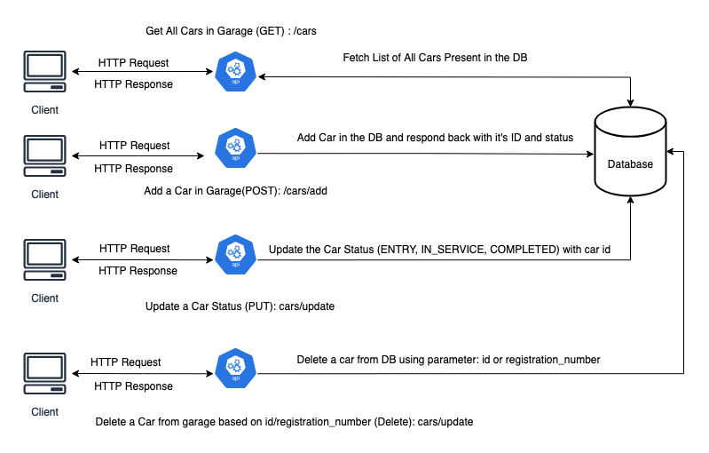
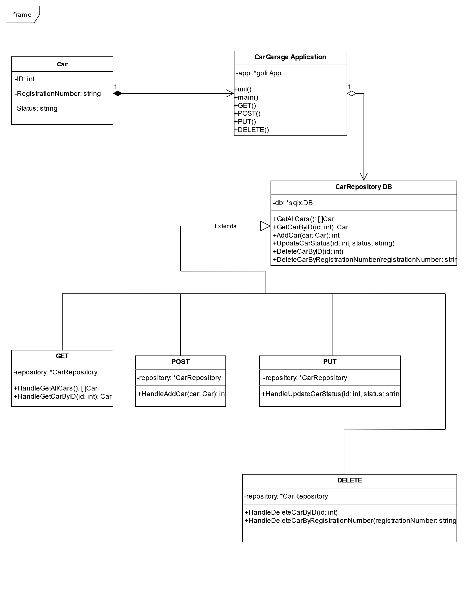

# goZop Garage Application

## Description
This is goZop Garage Application which has been created using Go language and GoFr Framework (Supports accelerated microservice development)

---

## Setup
0. Clone this repository
1. Setup Go on your system (https://go.dev/doc/install)<br>
2. Setup MySQL on local (https://dev.mysql.com/doc/mysql-getting-started/en/)<br>
    I. After Setting up MySQL ensure you have User Created and you have password for it <br>
    ```
    mysql -u root
    CREATE USER 'newuser'@'localhost' IDENTIFIED BY 'password';
    GRANT ALL PRIVILEGES ON *.* TO 'newuser'@'localhost' WITH GRANT OPTION;
    ```
    II. Login to MySQL and Create Database named "cars" <br>
    - For Workbench:
         https://dev.mysql.com/doc/workbench/en/<br>
    - For Terminal: ```mysql -u newuser -p -h 127.0.0.1 -P 3306``` <br>
    Create database: ```create database cars;```<br>

3. Replace with your MySQL username and password in configs/.env file<br>
    - DB_USER=YOUR_USERNAME
    - DB_PASSWORD=YOUR_PASSWORD

4. To run test go to your project repository and use this commmand
    - ```go test```

5. Run the Application using this command<br>
    - ``` go run main.go```

---

## System Design



#### The goZop appplication supports multiple API endpoints satisfying all the requirements mentioned in the product requirement doc:
-  GET /cars : It will fetch all the cars present in the garage from the database
-  POST /cars/add : It will add a car in the DB with it's id, registration number and service status. This endpoint ensures that no duplicate entries gets stored in DB
-  PUT /cars/update : This endpoint will update the car service status in the DB
-  DELETE /cars/delete/id or /registration : This will delete the car entry from DB using id or registration number of the car

---

## Database Schema and Flow



---

## API Endpoints:
1. <strong>Root Endpoint ("/"):<br></strong>
    - Method: GET
    - Response :
        ```
        {
            "data": "Garage Management Application is Up!"
        }
        ```
2. <strong>Get All Cars ("/cars"):<br></strong>
    - Method: GET
    - Response: Returns empty array if no data in DB else returns list of cars
        ```
        {
        "data": [
                {
                    "ID": 23,
                    "RegistrationNumber": "MP04K3487",
                    "Status": "IN_SERVICE"
                }
            ]
        }
        ```

3. <strong>Add Car to Garage ("cars/add?registrationNumber={REG_NUMBER}&status={STATUS}"):<br></strong>
    - Method: POST
    - Response (Successful): 
        - Returns the car id, registration_number and status on successful insertion
        ```
        {
            "data": {
                "id": 24,
                "registrationNumber": "RJ04M3877",
                "status": "IN_SERVICE"
            }
        }
        ```
    - Response (Duplicate Entry):
        - In case the car with same registration number exists in garage it gives response as car already exist
        ```
            {
                "data": "Car already in garage"
            }
        ```
4. <strong>Update Car Status ("cars/update?id={CAR_ID}&status={STATUS_TO_UPDATE}")<br></strong>
    - Method: PUT
    - Response :
        ```
        {
            "data": {
                "id": "23",
                "message": "Status updated successfully",
                "status": "IN_SERVICE"
            }
        }
        ```
5. 4. <strong>Delete the Car from Garage ("cars/delete/id?id={ID}" or "cars/delete/registration?registrationNumber={REG_NUMBER}")<br></strong>
    - Method: DELETE
    - Response : 204